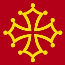
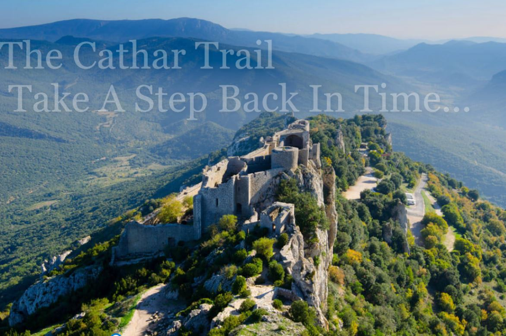

**<h1 align="center">The Cathar Trail</h1>**

 <h1 align="left">The Cathar Crest</h1>

# Overview
This is the second Milestone Project within the Code Institues Full Stack Web Development programme which will create
a fully responsive, interactive website available across all devices and will focus on the Languedoc region in the 
South of France.  The objective of the website is to raise awareness of the tranquility of the region and to encourage 
the public to broaden their travel experience and learn how the Cathars lived in this forgotten part of the world.

#   User Experience (UX)

*   User Stories
    *   **First Time Visitor**    

*   "I want to be able to learn more about the surrounding countryside and what the trip will offer in terms of an experience"
*   "I lead a busy life and would like to navigate my way around the site with ease to see what is on offer in the surrounding region"
*   "I always take note of testamonials from other users on all sites, so I would like to access the social media content and browse
    the site for feedback left by other travellers"
*   "I would like the opportunity to get in touch with the administrators to answer any questions I have before I make my booking"
*   "Can I sign up to publications to be kept informed of any updates or changes to packages on offer"

    *   **Returning Visitor**

*   "When I was planning my annual holiday earlier this year, I found the site very easy to navigate and details were available which made
    planning so much easier"
*   "I saw on their social media links that there was a sale on for Summer breaks - I'm here to find more details and to book something now
    for my annual trip"
*   "I have one or two questions still to address before I make my final booking and would like to submit a request for further details"

    *   **Frequent User**

*   "In my busy lifestyle, I don't have time to browse as often as I like so I would like to sign up for a newsletter so that I don't miss
    any offers or updates on upcoming trips"
*   "I find the links to the social media content easily accessible on the site and enjoy reading comments left by travellers who have recently
    enjoyed the Cathar Experience"

